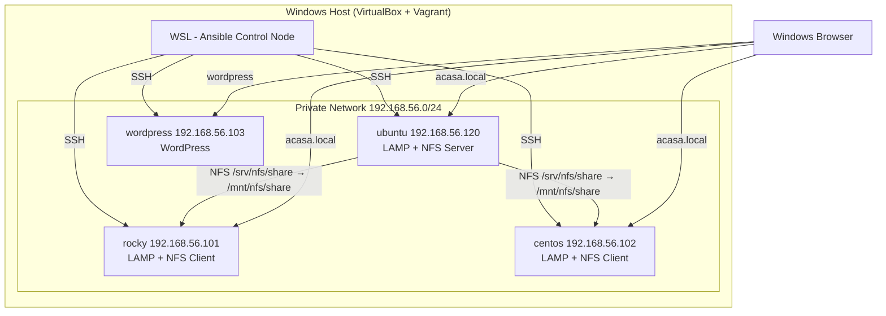

# Ansible Demo - LAMP Stack & WordPress Deployment

## Architecture



## What it does

- Installs Apache, MySQL, PHP on Ubuntu, Rocky Linux, and CentOS with automatic startup
- Creates virtual host `acasa.local` with a custom PHP page on all three LAMP servers
- Installs NFS server on Ubuntu; Rocky and CentOS automatically mount the share
- Deploys WordPress on a separate VM (triggered by `--tags wordpress`)

## Project Structure

- `inventories/hosts` - inventory file with VM definitions
- `inventories/group_vars/all.yml` - global variables (passwords, IPs, settings)
- `playbooks/site.yml` - main unified playbook
- `playbooks/test.yml` - verification playbook
- `roles/webserver` - LAMP stack installation and configuration
- `roles/nfsserver` - NFS server with IP-based access control
- `roles/wordpress` - WordPress installation
- `scripts/copy-keys.sh` - SSH key setup script

## Virtual Machines

| VM | IP | Role |
|---|---|---|
| ubuntu | 192.168.56.120 | LAMP stack + NFS server |
| rocky | 192.168.56.101 | LAMP stack + NFS client |
| centos | 192.168.56.102 | LAMP stack + NFS client |
| wordpress | 192.168.56.103 | WordPress |

## Installation

### 1. Start Virtual Machines (PowerShell)

```powershell
cd C:\Users\iacob\Documents\repos\Ansible-demo
vagrant up
```

### 2. Install Ansible Collections (WSL)

```bash
cd /mnt/c/Users/iacob/Documents/repos/Ansible-demo
ansible-galaxy collection install -r requirements.yml
```

### 3. Copy SSH Keys

```bash
bash scripts/copy-keys.sh
```

### 4. Test Connectivity

```bash
ansible all -m ping
```

### 5. Run Complete Deployment

```bash
# Deploy everything (LAMP, NFS, WordPress)
ansible-playbook playbooks/site.yml
```

Or run specific components:

```bash
# LAMP stack only
ansible-playbook playbooks/site.yml --tags lamp

# LAMP + NFS server
ansible-playbook playbooks/site.yml --tags lamp,nfs

# WordPress only
ansible-playbook playbooks/site.yml --tags wordpress
```

## Testing LAMP

### From WSL

```bash
# Check Apache is running on all webservers
ansible webservers -m shell -a "systemctl status apache2 || systemctl status httpd" -b

# Check MySQL is running
ansible webservers -m shell -a "systemctl status mysql || systemctl status mysqld" -b

# Test the custom PHP page (works without DNS)
ansible webservers -m shell -a "curl -s -H 'Host: acasa.local' http://localhost/ | grep 'Bine ai venit'" -b

# Check virtual hosts loaded
ansible ubuntu -m shell -a "apache2ctl -S 2>&1" -b
ansible rocky,centos -m shell -a "httpd -S 2>&1" -b

# Check MySQL databases
ansible webservers -m shell -a "mysql -e 'SHOW DATABASES;'" -b
```

### From Windows Browser

1. Open `C:\Windows\System32\drivers\etc\hosts` **as Administrator** and add:

```
192.168.56.120 acasa.local
```

2. Open your browser and visit **http://acasa.local**

   You will see the custom PHP page with server hostname, IP, OS, and PHP version.

3. To test **Rocky Linux**, change the hosts entry:

```
192.168.56.101 acasa.local
```

4. To test **CentOS**, change it to:

```
192.168.56.102 acasa.local
```

> You can only point `acasa.local` to one IP at a time.  
> Alternatively access by IP directly: http://192.168.56.101 and http://192.168.56.102

---

## Testing NFS

The NFS server runs on **ubuntu** and exports `/srv/nfs/share`.  
After running the playbook, **rocky** and **centos** automatically mount it at `/mnt/nfs/share`.

### From WSL

```bash
# Check NFS server is running
ansible nfsservers -m shell -a "systemctl status nfs-kernel-server" -b

# Check the exports configuration
ansible nfsservers -m shell -a "cat /etc/exports" -b

# Check active exports
ansible nfsservers -m shell -a "exportfs -v" -b

# Check the NFS mount on rocky and centos
ansible rocky,centos -m shell -a "mount | grep nfs" -b
ansible rocky,centos -m shell -a "ls -la /mnt/nfs/share" -b
```

### Test File Sharing

```bash
# Create a file on ubuntu's NFS share
ansible ubuntu -m shell -a "echo 'hello from ubuntu' > /srv/nfs/share/test.txt" -b

# Read it from rocky
ansible rocky -m shell -a "cat /mnt/nfs/share/test.txt" -b

# Read it from centos
ansible centos -m shell -a "cat /mnt/nfs/share/test.txt" -b

# Cleanup
ansible ubuntu -m shell -a "rm /srv/nfs/share/test.txt" -b
```

---

## Testing WordPress

### From WSL

```bash
# Check Apache and MySQL are running
ansible wordpress_vms -m shell -a "systemctl status apache2 mysql" -b

# Check WordPress files are present
ansible wordpress_vms -m shell -a "ls -la /var/www/html/wordpress/" -b

# Check WordPress database config
ansible wordpress_vms -m shell -a "grep 'DB_NAME\|DB_USER\|DB_HOST' /var/www/html/wordpress/wp-config.php" -b

# Test HTTP response
ansible wordpress_vms -m shell -a "curl -s http://localhost/wordpress/ | head -10" -b
```

### From Windows Browser

1. Add to `C:\Windows\System32\drivers\etc\hosts`:

```
192.168.56.103 wordpress.local
```

2. Visit **http://192.168.56.103/wordpress/**

   You will see the WordPress setup wizard.

---

## Run Automated Tests

```bash
ansible-playbook playbooks/test.yml
```

---

## Configuration

Edit `inventories/group_vars/all.yml` to customize:

| Variable | Default | Description |
|---|---|---|
| `apache_vhost_servername` | `acasa.local` | Virtual host server name |
| `apache_docroot` | `/var/www/acasa.local` | Document root path |
| `mysql_root_password` | `Secret123!` | MySQL root password |
| `nfs_export_dir` | `/srv/nfs/share` | NFS export directory |
| `nfs_allowed_ips` | `.101, .102, .120` | IPs allowed to mount NFS |
| `wordpress_db_name` | `wordpress` | WordPress database name |
| `wordpress_db_user` | `wpuser` | WordPress database user |
| `wordpress_db_password` | `Wp@Pass123!` | WordPress database password |

---

## Troubleshooting

### SSH Connection Issues

```bash
bash scripts/copy-keys.sh

# Clear stale keys if VMs were recreated
ssh-keygen -f "$HOME/.ssh/known_hosts" -R "192.168.56.120"
ssh-keygen -f "$HOME/.ssh/known_hosts" -R "192.168.56.101"
ssh-keygen -f "$HOME/.ssh/known_hosts" -R "192.168.56.102"
ssh-keygen -f "$HOME/.ssh/known_hosts" -R "192.168.56.103"
```

### VMs Not Responding

```powershell
vagrant status
vagrant reload
```

### Apache Shows Default Page

```bash
# Re-run LAMP deployment
ansible-playbook playbooks/site.yml --tags lamp

# Check sites-enabled (ubuntu)
ansible ubuntu -m shell -a "ls /etc/apache2/sites-enabled/" -b

# Check welcome.conf removed (rocky/centos)
ansible rocky,centos -m shell -a "ls /etc/httpd/conf.d/" -b
```

### NFS Mount Not Working

```bash
# Re-run full deployment
ansible-playbook playbooks/site.yml --tags lamp,nfs

# Check NFS service
ansible ubuntu -m shell -a "systemctl status nfs-kernel-server" -b
```

### Check Logs

```bash
ansible webservers -m shell -a "tail -20 /var/log/apache2/error.log || tail -20 /var/log/httpd/error_log" -b
ansible webservers -m shell -a "tail -20 /var/log/mysql/error.log || tail -20 /var/log/mysqld.log" -b
```

---

## Task Requirements Checklist

- ✅ Install Apache, MySQL, PHP, NFS server with automatic startup
- ✅ Configure Apache/MySQL/PHP with virtualhost `acasa.local` displaying custom PHP page
- ✅ Configure NFS server accessible only from specific network IPs
- ✅ NFS share automatically mounted on Rocky and CentOS clients
- ✅ Works on Ubuntu, Rocky Linux, and CentOS
- ✅ WordPress installed on a separate VM using `--tags wordpress`
